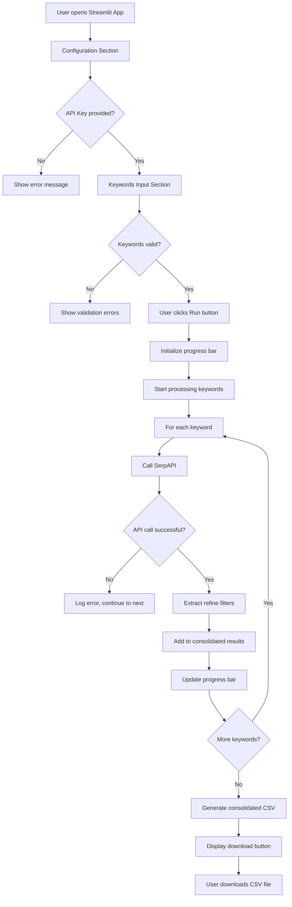

# Streamlit Shopping Facets Extractor - Architecture Plan

## Application Flow

## Application Structure

### Main Components

1. **Configuration Panel**
   - API key input (required)
   - Country selector (gl parameter, default: "us")
   - Language selector (hl parameter, default: "en")

2. **Keywords Input Section**
   - Text area for entering keywords (one per line)
   - Validation: maximum 30 keywords
   - Real-time keyword count display

3. **Processing Section**
   - Run button to start extraction
   - Progress bar showing current keyword being processed
   - Status messages for user feedback

4. **Results Section**
   - Download button for consolidated CSV
   - Summary statistics (total filters found, successful/failed searches)

### Technical Architecture

- **streamlit_app.py**: Main application file
- **search_utils.py**: Extracted search functions from main.py
- **Consolidated CSV Output**: Format with columns: `Keyword`, `Type`, `Title`

### Key Features

- **Error Resilience**: Continue processing even if some API calls fail
- **Progress Tracking**: Real-time updates during batch processing
- **Extensible Design**: Easy to add more SerpAPI parameters later
- **User-Friendly**: Clear validation messages and error handling

## Expected User Experience

1. User enters SerpAPI key
2. Optionally adjusts country and language settings
3. Enters keywords (one per line, max 30)
4. Clicks "Run Extraction"
5. Watches progress as each keyword is processed
6. Downloads consolidated CSV when complete

## Implementation Priority

The todo list follows a logical implementation order:
1. Setup and dependencies
2. Core UI components
3. Backend functionality
4. Integration and testing
5. Documentation